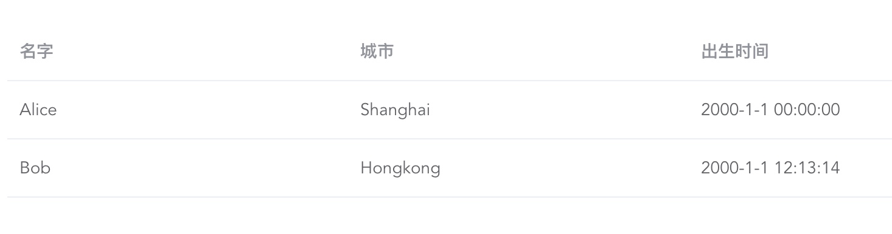
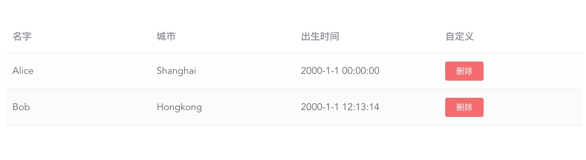

# elui-dyntable

基于 ElementUI 的 table 二次封装的组件，能根据数据自动生成 table，把模版代码最简化。

## 特点

- 内置了一些格式化数据方法，开箱即用，只要指定**formatter**即可，而对于一般的数据，不指定**formatter**则会根据数据类型匹配适当的格式化器。如果内置没有你需要的格式化器，你还可以传递自定义格式化器。还可以注册全局格式化器，这样就可以在其他组件里直接使用，去除重复代码。

- 可以控制列是否显示。

- 保留了 ElColumn 的 slot 能力，可以自定义列模版内容。

## 例子

### 1. 简单使用



```html
<EluiDynTable :desc="tableDesc" :data="tableData" />
```

```js
export default {
  name: "app",
  components: {
    EluiDynTable,
  },
  data() {
    return {
      tableDesc: [
        { prop: "name", label: "名字" },
        { prop: "city", label: "城市" },
        { prop: "born", label: "出生时间", formatter: "ts" },
      ],
      tableData: [
        {
          name: "Alice",
          city: "Shanghai",
          born: 946656000000,
        },
        {
          name: "Bob",
          city: "Hongkong",
          born: 946699994000,
        },
      ],
    };
  },
};
```

### 2. 自定义列



```html
<EluiDynTable :desc="tableDesc" :data="tableData">
  <EluiDynColumn prop="operation">
    <span slot="header">
      自定义
    </span>
    <div slot-scope="{ row, $index }">
      <el-button type="danger" size="mini" @click="handleClick(row, $index)"
        >删除</el-button
      >
    </div>
  </EluiDynColumn>
</EluiDynTable>
```

```js
export default {
  name: "app",
  components: {
    EluiDynTable,
    EluiDynColumn,
  },
  data() {
    return {
      tableDesc: [
        { prop: "name", label: "名字" },
        { prop: "city", label: "城市" },
        { prop: "born", label: "出生时间", formatter: "ts" },
        { prop: "operation", label: "操作", fixed: "right" },
      ],
      tableData: [
        {
          name: "Alice",
          city: "Shanghai",
          born: 946656000000,
        },
        {
          name: "Bob",
          city: "Hongkong",
          born: 946699994000,
        },
      ],
    };
  },
  methods: {
    handleClick(row, index) {
      /* eslint-disable no-console */
      console.log(`deleting ${row.name} at ${index}`);
    },
  },
};
```
